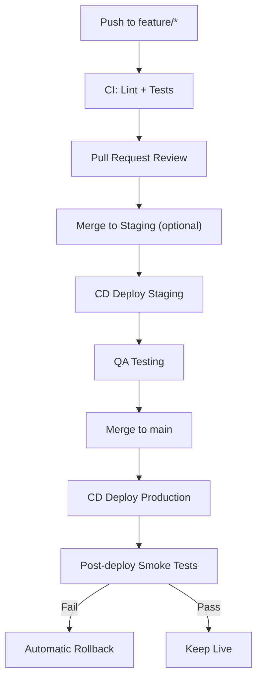

# E-Commerce API

A scalable, production-ready E-Commerce backend API built with **Node.js**, **Express**, and **MongoDB**.  
Supports **versioned API (v1)**, **CI/CD with Docker**, environment separation, and automated testing.

---

## Table of Contents

- [Features](#features)  
- [Tech Stack](#tech-stack)  
- [Folder Structure](#folder-structure)  
- [Environment Variables](#environment-variables)  
- [Installation](#installation)  
- [Docker Setup](#docker-setup)  
- [Running Locally](#running-locally)  
- [API Endpoints](#api-endpoints)  
- [Testing](#testing)  
- [CI/CD Workflow](#cicd-workflow)  
- [Contributing](#contributing)  
- [License](#license)  

---

## Features

- Versioned API (`/api/v1`)  
- CORS and security headers with Helmet  
- Express JSON body parsing  
- Logging with Morgan  
- MongoDB database with Mongoose  
- Unit & integration tests (Jest + Supertest)  
- CI pipeline for linting & testing  
- CD pipeline with automatic deployment, smoke tests, and rollback  
- Dockerized for consistent dev, CI, staging, and production environments  
- Ready for staging & production environments  

---

## Tech Stack

- **Node.js** (v22+)  
- **Express.js**  
- **MongoDB** with Mongoose  
- **Jest** + Supertest for testing  
- **ESLint** for code quality  
- **Helmet & CORS** for security  
- **GitHub Actions** for CI/CD  
- **Docker** + **Docker Compose** for development and deployment  

---

## Folder Structure
```text
ecommerce-api/
│
├─ src/
│ ├─ api/
│ │ └─ v1/
│ │ ├─ controllers/
│ │ ├─ routes/
│ │ └─ models/
│ ├─ config/
│ │ └─ cors.js
│ ├─ middleware/
│ │ └─ error.middleware.js
│ ├─ app.js
│ └─ server.js
│
├─ tests/
│ └─ health.test.js
│
├─ .github/workflows/
│ ├─ ci.yml
│ └─ cd.yml
│
├─ Dockerfile
├─ docker-compose.yml
├─ .env.development
├─ .env.production
├─ .env.test
├─ package.json
└─ README.md
```

> **Layered architecture** ensures scalability for future features like Auth, Products, Orders, and Payments.

---

## Environment Variables

Create `.env.*` files:

```env
PORT=5000
MONGO_URI=mongodb://mongo:27017/ecommerce
JWT_SECRET=your_jwt_secret
NODE_ENV=development
```
- ```.env.development``` → local dev

- ```.env.test``` → tests

- ```.env.production``` → production

---

## Installation
```bash
git clone <repo-url>
cd ecommerce-api
npm install
```

---

## Docker Setup

### Dockerfile

- Builds Node.js app inside container

- Exposes port 5000

### Docker Compose (Development + MongoDB)
```yaml
version: '3.9'

services:
  api:
    build: .
    ports:
      - "5000:5000"
    env_file:
      - .env.development
    volumes:
      - .:/usr/src/app
    depends_on:
      - mongo
    command: npm run dev

  mongo:
    image: mongo:6
    restart: always
    ports:
      - "27017:27017"
    volumes:
      - mongo-data:/data/db

volumes:
  mongo-data:
```
---

## Running loacally
```bash
# Using Docker Compose
docker-compose up

# Without Docker (local dev)
npm run dev
```
Check health:
```GET http://localhost:5000/api/v1/health```

---
## API Endpoints (v1)
### Health Check
```curl
GET /api/v1/health
Response:
{
  "success": true,
  "message": "API is running"
}
```

---
## Testing
```bash
# Run all tests
npm test

# Watch mode
npm run test:watch
```
- Uses Jest + Supertest
- Environment: ```.env.test```

---

## CI/CD Workflow
### Pipeline Overview
- CI (all branches/PRs): Lint + Unit & Integration tests

- CD (main merge): Build Docker image → Deploy → Post-deploy smoke test → Rollback if failed

---
## CI/CD Mermaid Diagram


---
## CI/CD Workflow Table
## CI/CD Workflow

| Stage / Step                          | Description | Trigger | Tools / Notes |
|--------------------------------------|------------|---------|---------------|
| **Push to feature branch**            | Developer pushes code | Any push to `feature/*` | Git, GitHub Actions CI |
| **CI: Lint + Tests**                  | Run ESLint, Prettier, unit & integration tests | Auto on push | Node.js, Jest, Supertest |
| **Pull Request Review**               | Team reviews code for quality and standards | Open PR | GitHub PR, code review |
| **Merge to Staging (optional)**      | Merge feature into staging branch | PR approved | CI/CD deploy staging |
| **CD Deploy Staging**                 | Deploy staging environment | Merge to staging | Docker, Docker Compose, Cloud (Render/Railway) |
| **QA Testing**                        | Run manual or automated tests on staging | After staging deploy | Postman, Jest, Supertest |
| **Merge to main**                     | Merge approved staging features to main branch | PR approved | GitHub |
| **CD Deploy Production**              | Build Docker image and deploy to production | Merge to main | Docker, Cloud platform |
| **Post-deploy Smoke Tests**           | Test critical endpoints (`/health`, `/auth`) | After production deploy | Curl, Jest, automated scripts |
| **Automatic Rollback (if Fail)**     | Revert to last stable version if tests fail | Smoke test fails | Docker, Cloud rollback |
| **Keep Live (if Pass)**               | Production remains live | Smoke test passes | Continuous production |
---